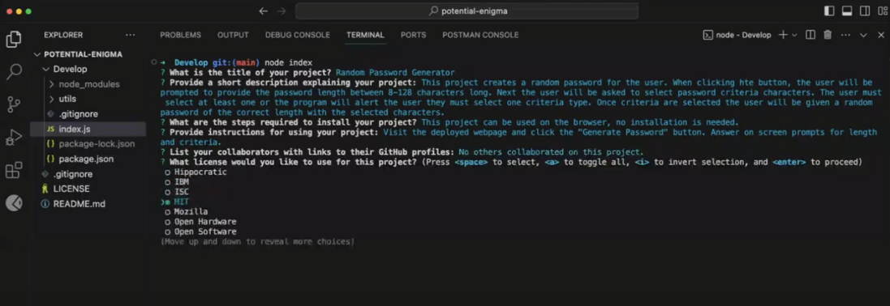

# README File Generator

## Description

This program takes input from the user to create a README markdown file. The file will create a headings and populate the sections with the input from the user. This project helps programmers save time when creating a README and ensures the format is professional and consistent.

Through this project I learned how to use npm, package.json files and dependencies, inquirer and using the integrated terminal to run/test the program.

## Table of Contents

- [Installation](#installation)
- [Usage](#usage)
- [Credits](#credits)
- [License](#license)

## Installation

To run this program you will need to run the command "npm i" in terminal for these files to install the dependencies.

Once you have installed the node modules, you will need to run the command "node index" in the terminal and answer the questions prompted.

## Usage

The program will create a markdown file locally with your generated README.

To see a video of the program running please visit this website: https://drive.google.com/file/d/1FK-MmG08IDibFshs8rPqyqxrrVM45kCa/view 

GitHub Repository URL: https://github.com/ahgeak/readme_file_generator 

Sample generated README file is located in the Develop folder; the file is named randompasswordgenerator.md

## Credits

I used documentation from the mdn website at: https://developer.mozilla.org/en-US/

I reviewed lessons and practice exercises on W3Shools at: https://www.w3schools.com/

I read forums on StackOverFlow at: https://stackoverflow.com/

I reviewed the npm documentation at: https://docs.npmjs.com/ 

I attended office hours where instructor Luigi discussed the project.

## License

This project users an MIT liscene.

![License]: (https://img.shields.io/badge/License-mit-yellow.svg)

![License Link]: MIT